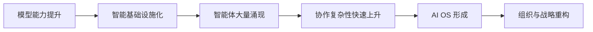
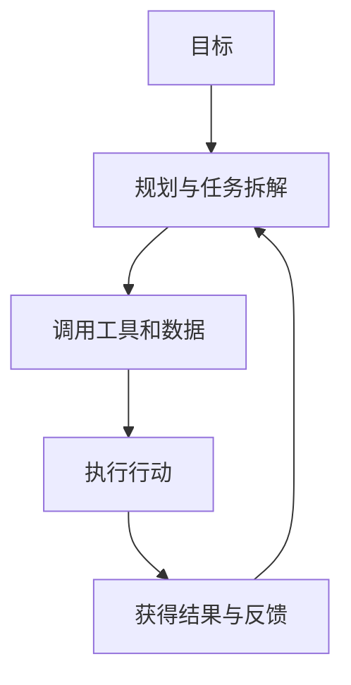
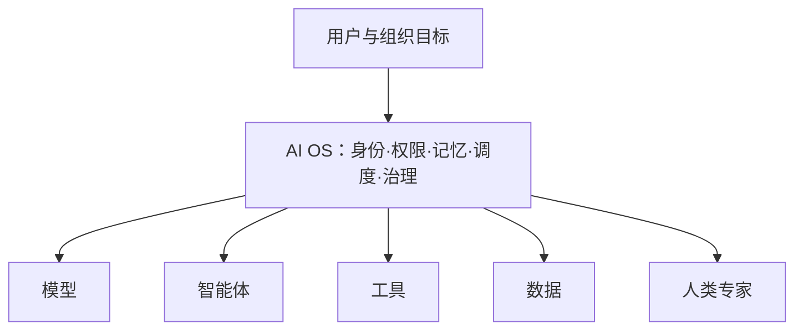
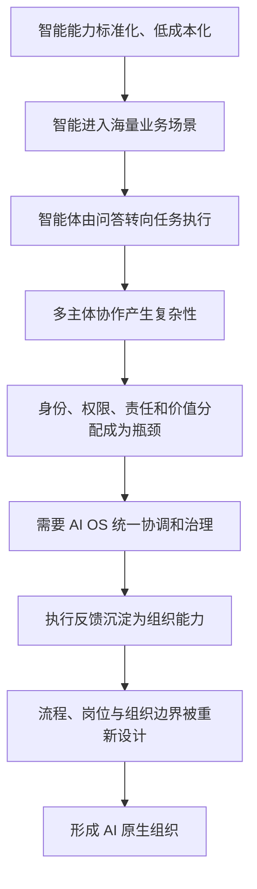

# 第一章｜AI 产业化的展开

> **核心结论：** AI 产业化不是“模型能力持续增强”这一条单线故事，而是一条由能力普及引发应用爆发、再由复杂性倒逼系统和组织重构的演化链。

## 一、全章金字塔

AI 的影响将依次穿透三个层级：

1. **工具层：智能成为基础设施。** 能力标准化、成本下降、调用门槛降低。
2. **系统层：智能体大量涌现。** AI 从回答问题转向执行任务，多智能体协作带来新的复杂性。
3. **组织层：生产关系被重写。** 企业需要重新安排权责、流程、治理和价值分配。

## 二、第一阶段：智能成为可调用的基础设施

大模型首先完成的是“能力供给方式”的变化：原本稀缺、昂贵、依赖专家的人类认知能力，开始被封装为可重复调用的服务。

这会产生三层结果：

- **供给扩大：** 更多个人和组织可以低成本获得通用智能。
- **创新加速：** 产品不必从零训练能力，可以直接组合现成模型。
- **竞争迁移：** 单纯拥有模型不再足够，价值转向场景、数据、流程和反馈。

因此，模型能力提升只是起点；真正决定商业价值的，是智能能否进入具体任务并持续产生结果。

## 三、第二阶段：智能体从“回答”走向“行动”

智能体把模型、工具、记忆和目标连接起来，使 AI 能够感知环境、拆解任务、调用资源并执行行动。

但智能体越多，系统并不必然越高效。能力增长的同时，至少出现五类治理难题：

| 难题 | 本质问题 |
| --- | --- |
| 效果透明 | 如何知道智能体为什么这样判断、执行是否可靠 |
| 持续选择 | 谁来选择模型、工具、流程和下一步行动 |
| 信任与权限 | 智能体能看到什么、能调用什么、能代表谁行动 |
| 责任归属 | 出错后由模型、开发者、使用者还是组织负责 |
| 价值分配 | 数据、模型、平台、智能体与用户如何分享收益 |

**关键判断：** 当协作复杂性增长得比单体能力更快，产业瓶颈就会从“模型够不够强”转向“系统能不能组织这些能力”。

## 四、第三阶段：AI OS 成为新的协调层

AI OS 不是传统操作系统的简单升级，而是智能时代的协调机制。它连接模型、智能体、工具、数据和人，并为它们提供统一的身份、权限、记忆、协作与治理框架。

AI OS 解决的不是某个孤立功能，而是四个系统级问题：

1. **发现与组合：** 为任务匹配合适的模型、工具和智能体。
2. **上下文连续：** 让任务在多轮、多角色和多系统之间保持记忆。
3. **权责治理：** 规定访问边界、审批机制、审计路径和最终责任。
4. **反馈进化：** 把执行结果沉淀为可复用的组织能力。

## 五、终局指向：AI 原生组织

当 AI 能承担越来越完整的任务，企业不能只把它嵌入旧流程。旧流程是围绕人的信息处理能力设计的，简单叠加 AI 往往只会局部提效，并保留原有瓶颈。

AI 原生组织需要重新回答：

- 哪些决策由 AI 默认执行，哪些必须由人确认？
- 人应当从执行者转向目标设定者、判断者还是责任承担者？
- 组织边界、岗位定义和管理跨度如何变化？
- 如何把个体与智能体的反馈汇入共同的学习系统？

## 六、完整推演

## 七、一句话带走

**模型决定智能的上限，智能体把能力带入任务，AI OS 管理协作复杂性，而组织重构才决定 AI 能否真正转化为长期生产力。**

