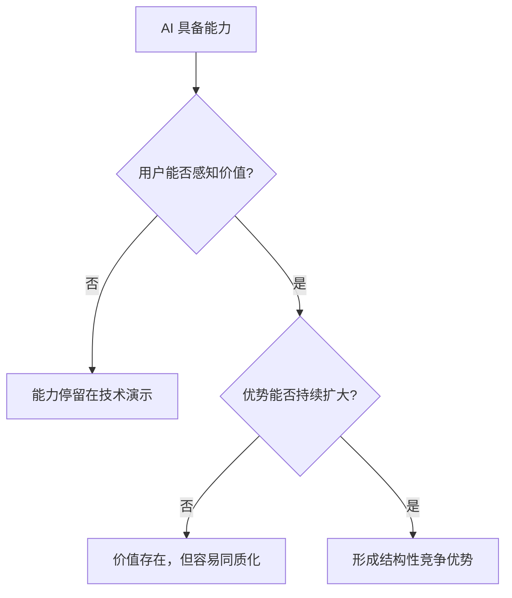
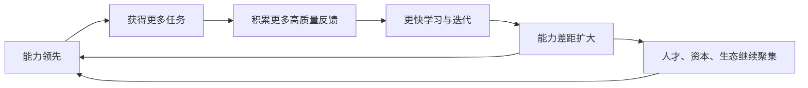
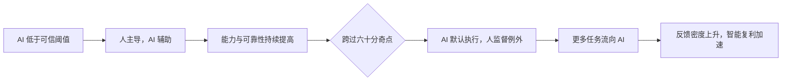
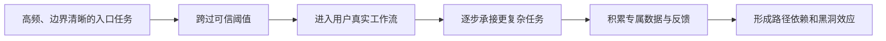
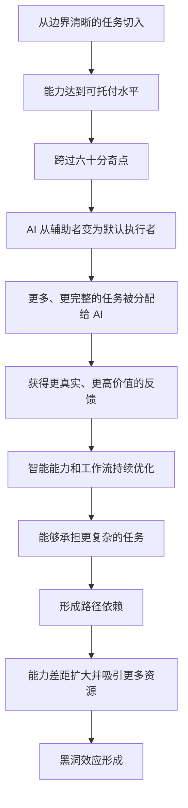

# 第二章｜智能复利和黑洞效应

> **核心结论：** 智能复利解释 AI 如何不断创造更高价值，黑洞效应解释领先者如何把价值积累为结构性优势；两者之间的关键转折，是 AI 跨过“六十分奇点”并取得任务主导权。

## 一、全章金字塔

本章回答三个递进问题：

1. **能力为什么会越用越强？** 因为任务、结果和反馈构成学习飞轮。
2. **能力为什么会变成竞争优势？** 因为复杂任务具有路径依赖，先发者能获得更多高价值反馈。
3. **优势何时开始自我强化？** 当 AI 达到可托付水平，任务分配向它倾斜，形成智能黑洞。

## 二、智能复利：能力增长来自闭环，而非一次训练

智能系统的价值不只取决于初始能力，更取决于能否从真实使用中持续学习。

复利形成需要一个完整闭环：

- **执行：** 在真实场景中完成任务。
- **反馈：** 获得结果、评价、修正和行为数据。
- **学习：** 优化模型、提示、工具组合与工作流。
- **升级：** 以更高成功率承担更复杂任务。
- **再投入：** 更复杂的任务带来更高质量的反馈。

因此，领先并不是一个静态能力值，而是一种更快、更稳定的学习速度。

## 三、价值创造不等于竞争优势

AI 能完成任务，只说明它创造了价值；要形成商业壁垒，还必须通过两道门槛。

第一道门槛是**用户价值**：结果是否更好、更快、更便宜，且可靠到足以进入实际流程。

第二道门槛是**相对优势**：竞争者是否能用同样的模型、数据和产品设计迅速复制。如果答案是能，价值就难以成为护城河。

## 四、简单任务与复杂任务：复利空间不同

| 维度 | 简单任务 | 复杂任务 |
| --- | --- | --- |
| 评价标准 | 明确、稳定 | 多维、动态、依赖情境 |
| 反馈质量 | 容易获得但信息量有限 | 难以获得但信息密度高 |
| 复制难度 | 较低 | 较高 |
| 路径依赖 | 弱 | 强 |
| 长期壁垒 | 容易收敛 | 容易拉开差距 |

简单任务适合快速产品化，却容易被追平；复杂任务起步较慢，却能通过长期上下文、专属反馈和工作流积累形成路径依赖。

这意味着：**容易做的场景帮助产品跨过生存线，难而有价值的场景决定长期上限。**

## 五、黑洞效应：领先者吸走任务、反馈与资源

当一个智能系统表现更好，用户会把更多任务交给它；更多任务又产生更多数据与反馈，使其进步更快，进一步扩大与其他系统的差距。

黑洞效应成立，需要四个条件同时存在：

1. **任务存在足够大的学习空间。** 系统能够通过反馈持续改善。
2. **能力差距能被用户感知。** 更强必须转化为明显更好的结果。
3. **学习过程具有路径依赖。** 后来者不能只靠购买同一基础模型追平。
4. **能力差距会改变任务分配。** 用户愿意把更多、更关键的工作交给领先者。

少一个条件，飞轮都可能停转：没有学习空间就没有复利，没有感知差距就没有迁移，没有路径依赖就没有壁垒，没有任务转移就没有高质量反馈。

## 六、“六十分奇点”：从辅助工具到默认执行者

所谓六十分，不是固定的考试分数，而是一个信任阈值：AI 的综合表现达到“可以被托付”的水平。

奇点前后，责任结构发生根本变化：

| 奇点之前 | 奇点之后 |
| --- | --- |
| AI 提供建议 | AI 默认执行 |
| 人逐步操作 | 人设定目标和边界 |
| 人检查每一步 | 人处理异常和抽查结果 |
| 人对过程负责 | 人对目标、授权与最终结果负责 |

一旦跨过阈值，AI 获得的不只是更多使用次数，而是更完整的任务、更真实的结果和更关键的反馈。学习速度因此发生跃迁，黑洞效应开始显著增强。

## 七、战略选择：入口要容易，方向要足够难

企业需要在两个看似矛盾的目标之间取得平衡：

- **从简单任务切入：** 快速达到可靠可用，跨过用户的信任阈值。
- **向复杂任务延伸：** 获取差异化反馈，形成难以复制的路径依赖。

只做简单任务，产品容易普及却难以建立壁垒；只攻复杂任务，可能迟迟无法达到可用水平，得不到真实反馈。更合理的路径是：

## 八、判断智能复利是否成立

不能只看模型分数或调用量，更应观察以下指标：

- 任务完成率是否随使用持续提高？
- 用户是否愿意交出更完整、更关键的任务？
- 单位任务所需人工干预是否下降？
- 反馈是否能进入产品和模型的迭代闭环？
- 领先者与追赶者的差距是在收敛还是扩大？

## 九、完整推演

## 十、一句话带走

**智能复利的核心不是 AI 自动变聪明，而是任务与反馈形成闭环；黑洞效应的核心不是规模本身，而是跨过信任阈值后，更多高价值任务持续流向领先者。**

