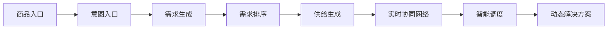
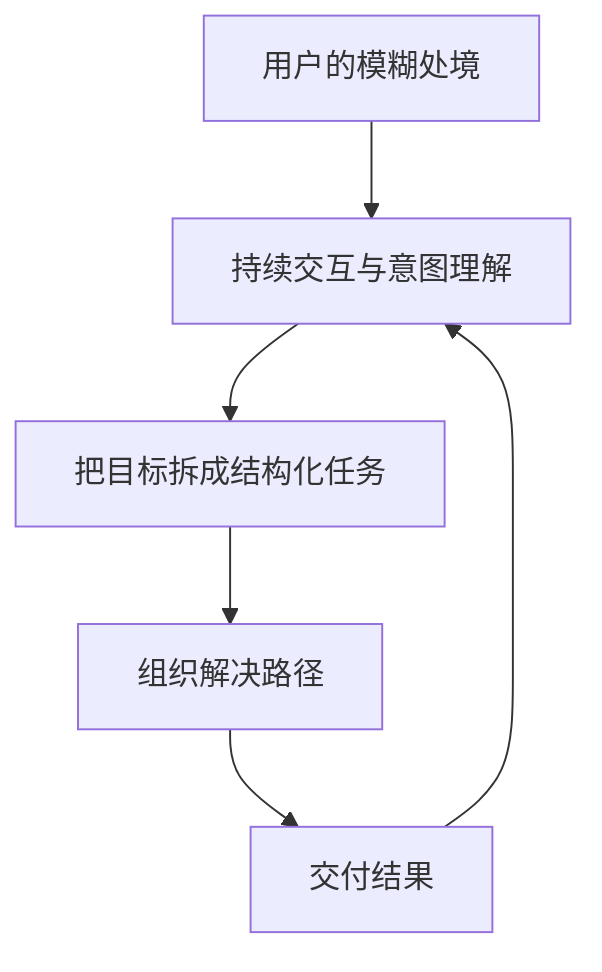
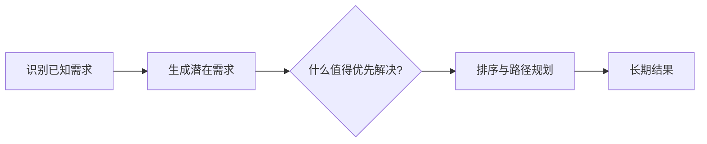
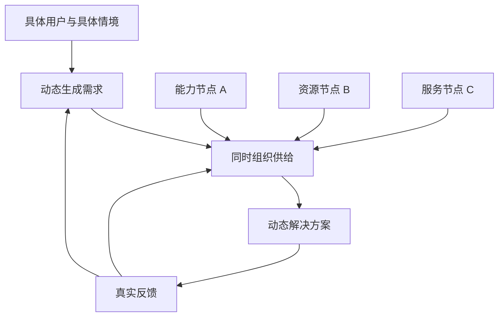
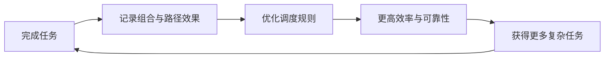
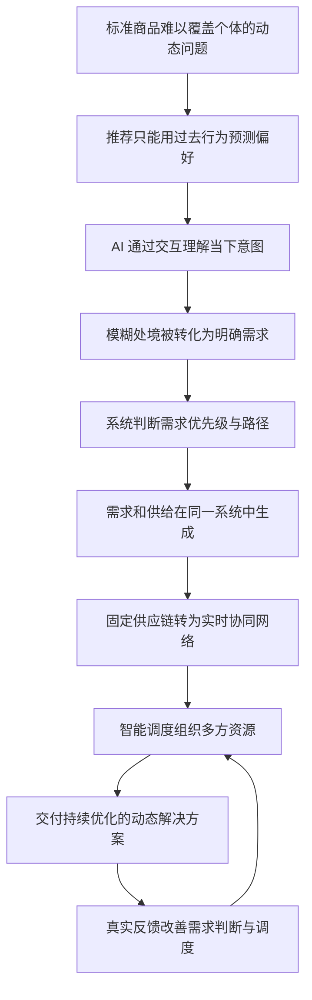

# 第三章｜一人千面：智能商业范式大变革

> **核心结论：** AI 对商业最深层的改变，不是让推荐更精准，而是把商业的基本单位从“预先生产的商品”变成“围绕具体的人、具体情境和具体目标实时生成的解决方案”。

## 一、全章金字塔

本章的论证可以压缩为一条主线：

1. **旧范式失效：** 标准化产品和存量匹配无法理解人的当下问题。
2. **需求侧重构：** 商业入口从商品请求迁移到真实意图，并参与需求生成与优先级判断。
3. **供给侧重构：** 供给不再预先确定，而是在反馈中动态组合和生成。
4. **平台侧重构：** 核心资产从流量与资源所有权，迁移到任务拆解和资源调度规则。

## 二、为什么“千人千面”仍不够

三个时代对应三种客户价值实现方式：

| 商业范式 | 主要问题 | 基本单位 | 核心能力 | 主要局限 |
| --- | --- | --- | --- | --- |
| 千人一面 | 如何低成本服务大众 | 标准商品 | 标准化、规模化 | 忽略个体差异 |
| 千人千面 | 如何让不同人找到合适商品 | 匹配 | 行为数据、推荐算法 | 用过去行为推测当下意图 |
| 一人千面 | 如何解决此刻这个人的具体问题 | 动态解决方案 | 意图理解、生成、调度 | 依赖信任、治理与协同基础设施 |

推荐系统擅长回答“你属于哪类人”“你可能继续看什么”，却难以回答“你现在真正要解决什么问题”。行为反映的是注意力去向，意图指向的才是目标。

因此，“一人千面”不是把人群标签切得更细，而是放弃固定答案：围绕一个人在特定时间、情境与约束下的目标，生成当下更合适的解。

## 三、第一步：商业入口从商品迁移到意图

人真正需要的通常不是商品本身，而是商品背后的结果：购买课程是为了通过考试或改善学习状态，购买设备是为了保护健康。

传统商业必须等用户把问题翻译成商品请求；大模型通过持续自然语言互动，可以先理解目标结构，再定义任务。这使商业系统第一次有机会从原始问题出发。

这会改变入口权力：过去谁控制货架、搜索和推荐位，谁控制商品入口；未来谁最先进入用户任务形成的时刻，谁就更有机会定义解决路径。

## 四、第二步：从发现需求到生成需求

“发现需求”默认需求已经存在且可以表达，企业只需更早识别；“生成需求”则承认重要问题往往模糊、未成形，甚至用户自己也说不清。

AI 通过互动把模糊困境逐步转化为清晰目标，商业起点由“等待需求”变成“帮助用户定义问题”。但这也产生新的稀缺性：系统可以生成的潜在需求接近无限，用户的时间、注意力和资源却有限。

于是，竞争继续向上游迁移：

**你的笔记抓住了这一层的实质：**“时间是有限的，要有优先级，有排序，有路径。”真正高阶的系统不是无限放大问题，而是帮助用户判断当前最值得投入的瓶颈。

这使品牌承担了更重的责任：低水平系统利用需求生成制造焦虑，高水平系统帮助用户克制、取舍，并为长期目标服务。

## 五、第三步：从意图匹配到需求与供给同时生成

仅仅理解意图仍不等于进入新范式。如果系统最后只能从既有课程、航班、酒店或商品中选择，它依然只是更高级的匹配者。

真正的“一人千面”要求需求生成与供给生成在同一个系统里同步发生：系统理解具体的人之后，不是检索固定库存，而是临时组合能力、资源和服务，形成动态解决方案。

商业单位因此发生迁移：

- 工业时代卖商品；
- 互联网时代卖匹配；
- 生成时代卖持续优化的目标实现过程。

## 六、第四步：供应链变成实时协同网络

固定供应链依赖预测：先判断未来需求，再沿稳定路径批量生产。生成式供给依赖反馈：小规模进入市场，用真实响应决定下一步生产和资源组合。

供给由一次性完成变成持续调整，信息由单向传递变成多节点实时反馈，企业也从固定链条中的位置变成网络中可被动态调用的能力节点。

你的三条笔记恰好构成这一步的验证与修正：

- **“动态协作，按需合作”**概括了网络结构；
- **“基建能力”**指出个性化服务不能只靠前端模型，必须建立强协同网络；
- **“这不是淘宝网红早期的路径吗？”**提醒我们：小批量测试、预售和反馈生产早已存在，AI 的新意不是发明反馈驱动，而是把它扩展到更复杂任务，并显著降低实时理解与组合的成本。

## 七、终点：智能调度成为商业的新操作系统

当需求与供给都动态变化，生产资源本身不再是唯一稀缺项。真正困难的是，在特定约束下快速选择节点、拆解任务、组合资源、处理异常并持续优化。

作者据此提出：企业竞争将从“拥有资源”转向“组织资源”。调度壁垒不是别人没有同样的资源，而是别人无法用同样的效率和可靠性组织它们。

平台资产也随之变化：

| 互联网平台 | 智能调度平台 |
| --- | --- |
| 核心资产是流量与连接 | 核心资产是任务拆解与调度规则 |
| 匹配已有需求和供给 | 同时参与需求与供给生成 |
| 优化交易频次 | 优化目标实现过程 |
| 网络效应积累连接优势 | 智能复利积累组织资源的能力优势 |

## 八、对本章的审慎判断

### 1. 方向成立，但“新旧断裂”被放大了

反馈驱动供给、柔性生产和动态协作并非 AI 才出现。希音、预售和小单快反都可在前 AI 时代运行。AI 更可信的作用是把需求理解、方案生成和资源调度的成本降下来，使这种机制覆盖更复杂、更长链条的服务。

### 2. 调度规则不只是企业能力，也是治理权力

你的判断“更像是国家层面要做的事情”很重要。调度者决定哪些资源被调用、哪些目标优先、风险由谁承担，这已经超出效率问题，涉及公共规则、行业标准、平台权力和责任分配。企业可以建设垂直场景的调度系统，但跨行业的事实标准不应只由效率最高者单方面决定。

### 3. 从理解意图到代表用户，存在信任鸿沟

系统能够推断需求，不代表它有权替用户定义人生优先级。教育、健康、金融等复杂服务尤其需要解释机制、授权边界和人工纠偏，否则“帮助选择”很容易变成更隐蔽的操控。

### 4. 动态方案的价值必须用长期结果验证

个性化不是越多越好。一个系统能生成千种方案，并不等于它能稳定交付更好的结果。真正的评价指标应从点击、转化和短期满意度，转向目标完成率、长期收益、人工干预率与副作用。

## 九、对在线教育的可执行翻译

结合你的笔记，在线教育可以把这章转化为一条逐步演进的路线，而不是直接追求宏大的“教育 AI OS”：

1. **从问题入口开始：** 先接收“孩子做题变慢、抗拒作业”等真实表述，而不是先推课程。
2. **建立优先级模型：** 在知识、习惯、节奏、情绪等需求中，判断当前最值得解决的瓶颈。
3. **生成阶段性路径：** 组合诊断、讲解、练习、反馈和人工服务，而非只推荐标准课程。
4. **建设可调用能力节点：** 把题目、教师、内容、工具和服务沉淀为可评估、可组合的模块。
5. **从结果学习：** 用学习效果和后续行为更新判断，不以使用时长或推荐点击代替教育结果。

## 十、完整推演

## 十一、一句话带走

**“一人千面”的本质不是多做几套个性化商品，而是从人的真实问题出发，判断什么最值得解决，再用实时协同网络持续生成和优化解决方案；未来的壁垒也将从资源占有转向可信的资源调度。**

---

> 证据说明：本笔记依据第三章个人划线与想法重组，未获得原书完整正文与稳定页码，因此不作为逐页复述；引用仅用于定位个人笔记关注点。
